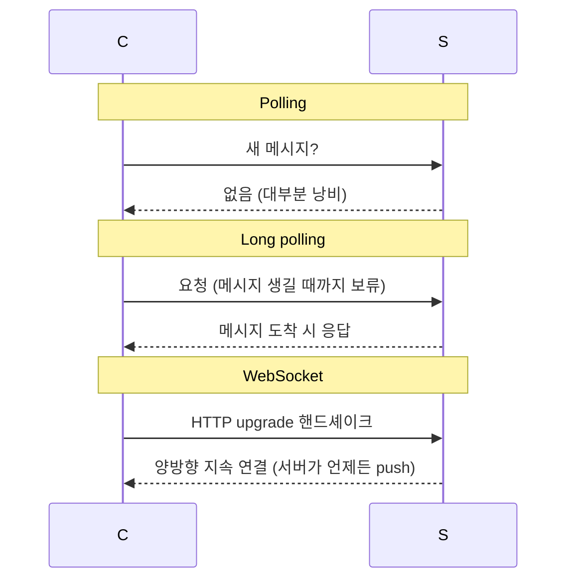

# WebSocket (vs Polling / Long Polling)

## 한 줄 정의

**서버가 클라이언트에게 능동적으로 데이터를 밀어넣어야 하는** 실시간 통신을 위한 양방향·지속(persistent) 연결 프로토콜. HTTP의 client-initiated 한계를 우회하는 polling → long polling → WebSocket 진화의 종착점이다 (ch12, p.180-183).

## 왜 필요한가

HTTP는 **요청을 클라이언트가 시작**한다. 채팅에서 송신(client→server)은 HTTP로 충분하지만, **수신(server→client)**은 서버가 먼저 보내야 하는데 HTTP로는 자연스럽지 않다. 이 "server push"를 흉내 내려는 시도가 polling·long polling이고, 진짜 양방향을 여는 게 WebSocket이다.

## 핵심 메커니즘

### 세 기법 비교

| 기법 | 연결 | 지연 | 비용 |
|---|---|---|---|
| Polling | 주기적 단발 | 폴링 주기만큼 | 빈 응답 낭비 |
| Long polling | 메시지/timeout까지 보류 | 낮음 | 송수신 서버 불일치·끊김 감지 어려움 |
| **WebSocket** | 영구 양방향 | 가장 낮음 | 연결 관리(서버 stateful) |

### WebSocket 특성

- 클라이언트가 시작, **HTTP 연결로 출발해 핸드셰이크로 "upgrade"**.
- 양방향(bi-directional)·지속(persistent) — 서버가 언제든 클라이언트로 push.
- 포트 80/443 사용 → 방화벽 통과 용이.
- 송·수신 양쪽에 쓰면 설계 단순화.

## 트레이드오프 & 선택 기준

- **stateful 비용**: 지속 연결을 서버가 들고 있어야 해 연결당 메모리(예 ~10KB)·관리 부담. 1M 동시 연결 ≈ 10GB. 그래서 chat server는 stateful이 되고 [[service-discovery]]로 연결 분산이 필요.
- 단발성·저빈도 업데이트엔 과함 — long polling이나 SSE가 더 단순할 수 있다.
- 모든 기능을 WebSocket으로 할 필요는 없다. 로그인·프로필 등은 전통 HTTP request/response가 적합.

## 실무 적용 시 고려사항

- WebSocket은 stateless가 아니라 **연결 친화도(connection affinity)**가 생긴다 — 라운드로빈 LB가 안 맞고, 연결 유지·재배치 전략이 필요.
- 연결이 끊기면 재연결 + 그동안 놓친 메시지 동기화 로직(예 `cur_max_message_id` 기반 pull)이 필수.
- 대안: **SSE(Server-Sent Events)**는 단방향 server→client만 필요할 때 더 가볍다. gRPC streaming, MQTT(IoT)도 상황별 대안.
- heartbeat로 죽은 연결을 감지 ([[presence-and-heartbeat]]).

## 다른 개념과의 관계

- [[service-discovery]] — WebSocket의 stateful 연결을 어느 서버에 붙일지 결정.
- [[presence-and-heartbeat]] — 지속 연결의 생사를 heartbeat로 판정.
- [[publish-subscribe]] — WebSocket이 전달 채널, pub/sub이 이벤트 라우팅.

## 등장 사례

- ch12 — 채팅 송·수신 양방향 통신의 주 프로토콜
- Facebook — 초기엔 HTTP 송신, 이후 실시간 수신에 지속 연결 도입
- Slack/Discord — 실시간 메시징의 WebSocket 활용
